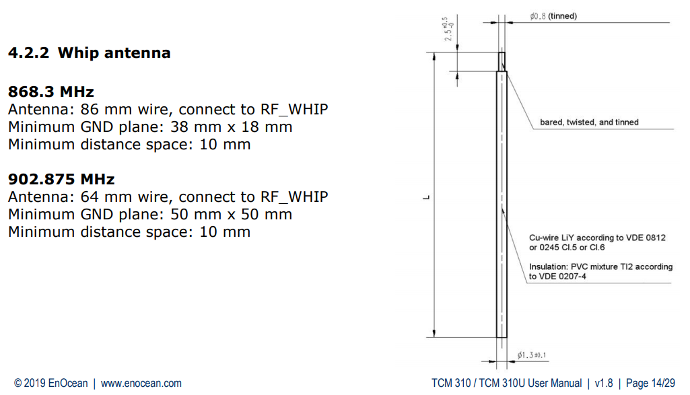
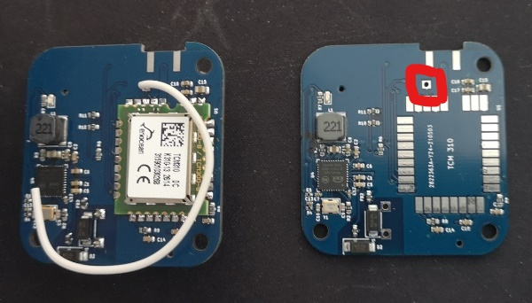
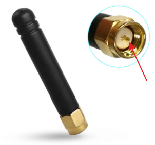

# Antennen Design

## **Variante 1: Whip antenna**

I used the KNX cable for that

Solder point for antenna cable (red arrow)

----------------------------------------------------------

## **Variante 2: SMA 868 MHz Antenna**

_Important: SMA with Pin (red arrow)

