# Applikationsbeschreibung EnOcean-Gateway

## Wichtige Hinweise

* Diese KNXprod wird nicht von der KNX Association offiziell unterstützt!
* Die Erzeugung der KNXprod geschieht auf Eure eigene Verantwortung!

## Änderungshistorie

10.07.2021: Applikation 0.10

* Add EEP Profil A5-14-0x

## Dokumentation

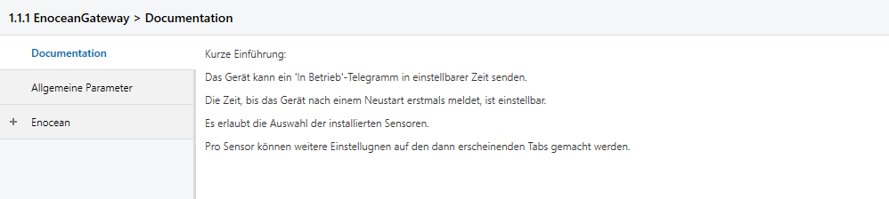

Hier findet man eine Kurzbeschreibung zu allen wichtigen Funktionen

## Allgemeine Parameter

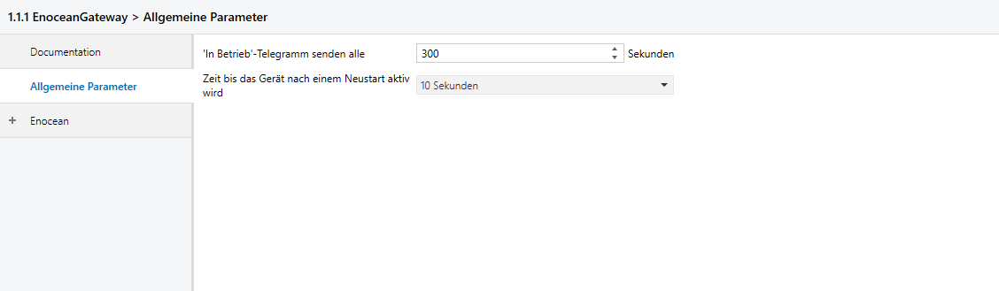

### In Betrieb senden alle

Das Gerät kann einen Status "Ich bin noch in Betrieb" über das KO 1 senden. Hier wird das Sendeintervall in Sekunden eingestellt.

### Zeit bis das Gerät nach einem Neustart aktiv wird

Nach einem Neustart des Geräts, sei es durch Busspannungsausfall, Reset über den Bus oder auch durch ein Drücken der Reset-Taste, kann man hier festlegen, wie viele Sekunden vergehen sollen, bis das Gerät seine Funktion aufnimmt.

Da das Gerät prinzipiell (sofern parametriert) auch Lesetelegramme auf den Bus senden kann, kann mit dieser Einstellung verhindert werden, dass bei einem Busneustart von vielen Geräten viele Lesetelegramme auf einmal gesendet werden und so der Bus überlastet wird.

## Enocean

### Übersicht

Hier stehen bis zu 50 Kanäle zur Verfügung. Ein Kanal entspricht einem Device auch wenn dieses mehr als einen Wert liefert.

 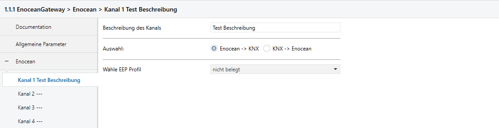

#### Beschreibung des Kanals

Hier kann man eine kurze Beschreibung des Kanals hinterlegt werden. Diese wird automatisch wie bei vielen anderen KNXProd in die Übersicht links übernommen und taucht auch im Reiter Kommunikationsobjekte auf.

#### Auswahl

Hier wird die Richtung des Kanals festgelegt.

#### Wähle EEP Profil

Hier können die vorhanden EEP Profile gewählt werden. Es stehen zur Verfügung:

 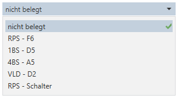

### Kanal EEP Auswahl

#### RPS

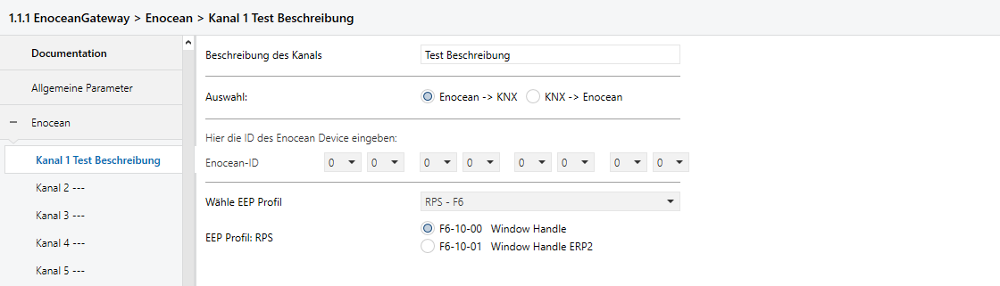

Im RPS Reiter stehen aktuell nur die Profile F6-10-0x zur Verfügung. Die weiteren Profile für die ROCKER Taster findet ihr im eigenen „ROCKER“ Kapitel, siehe unten.

#### 1BS

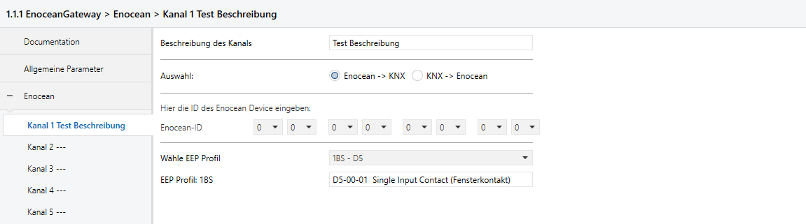

Für die 1BS Message steht folgendes Profil zur Verfügung: D5-00-01

#### 4BS

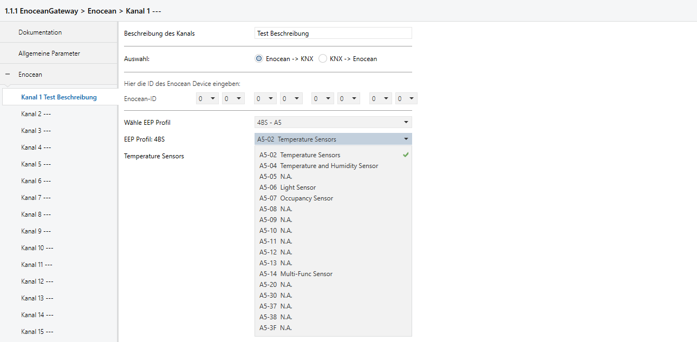

#### VLD

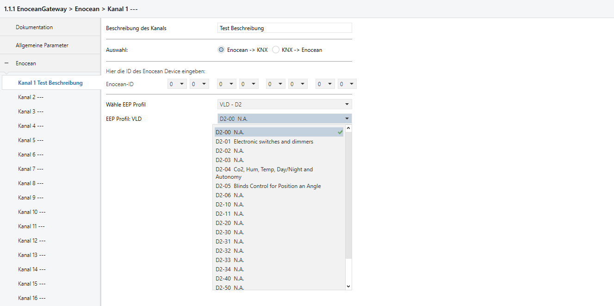

#### Rocker

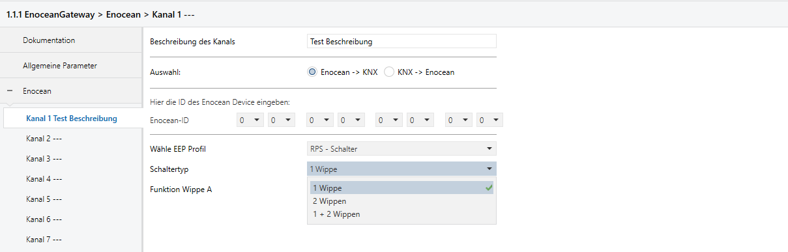

##### Auswahl Schaltertyp

Das Schaubild unten zeigt die Anordnung der Wippen und der dazugehörigen Channels

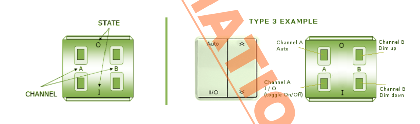

Wippe AB  bildet die Funktion ab wenn, wenn beide Wippen eines Tasters mit zweit Wippen gleichzeitig gedrückt werden. Damit ist es möglich eine zusätzliche Funktion umzusetzen.

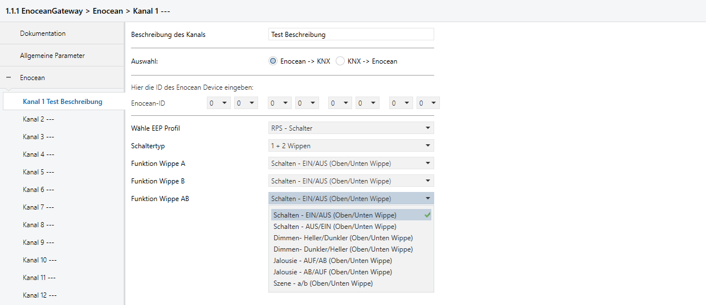

Pro Wippe stehen vier Funktionen bereit: Schalten, Dimmen, Jalousie und Szenen.

Wird der Taster nach Vorgabe (State=0 oben) verbaut, dann kann gewählt werden:

* Schalten EIN/AUS (Oben/Unten Wippe)
* Dimmen Heller/Dunkler (Oben/Unten Wippe)
* Jalousie AUF/AB (Oben/Unten Wippe)

Sollte diese Richtung nicht passen, kann jeweils die gegenläufige Position gewählt werden. Fehlt euch die Information wie rum der Taster verbaut ist, hilft nur das ausprobieren.
