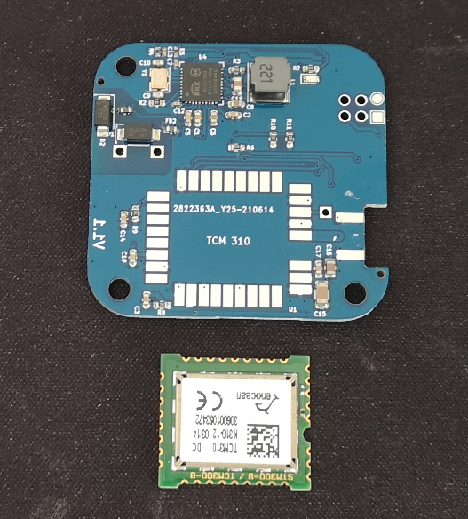
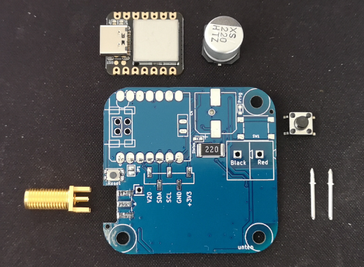
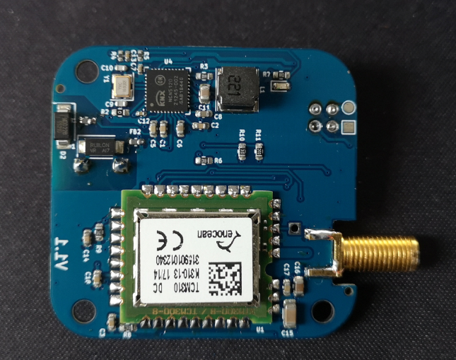
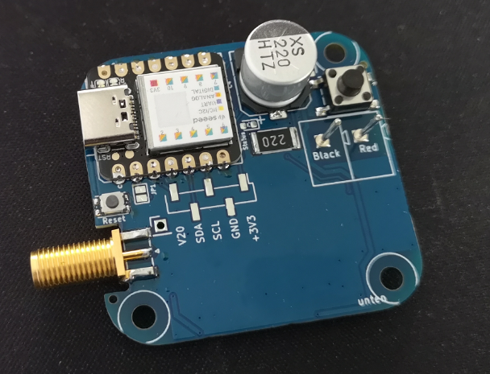

# Mounting Instruction

**Component Overview** 

the device kit consists of this parts:

- Arduino Xiao Board
- Enocean TCM310 Module
- 220uF / 35V Elko
- Push Button
- KNX Pins
- SMA Antenna Connector (female) 

--------------------------------------------------
**final assembly** 

Note: the SMA connector is only needed in case you want to use an external Antenna. For more information see [link](https://gitlab.com/DIY-Smarthome-Projekt/knx-enocean-gateway/-/blob/main/doc/Antennen_Design.md)

