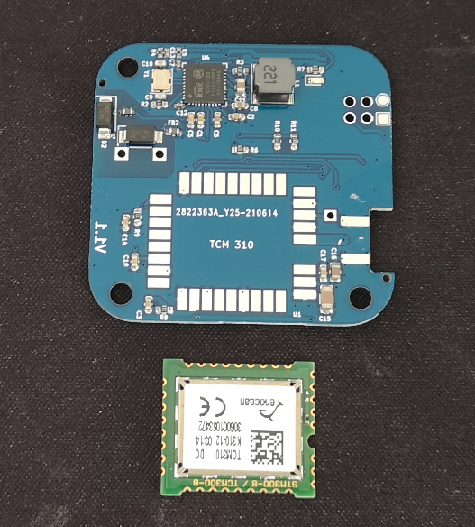
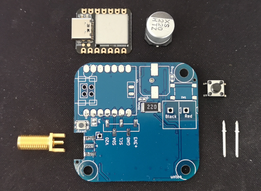

# Mounting Instruction

**Component Overview** 

the devide kit consists of this parts:

- Arduino Xiao Board
- Enocean TCM310 Module
- 220uF / 35V Elko
- Push Button
- KNX Pins
- SMA Antenna Connector (female) 

